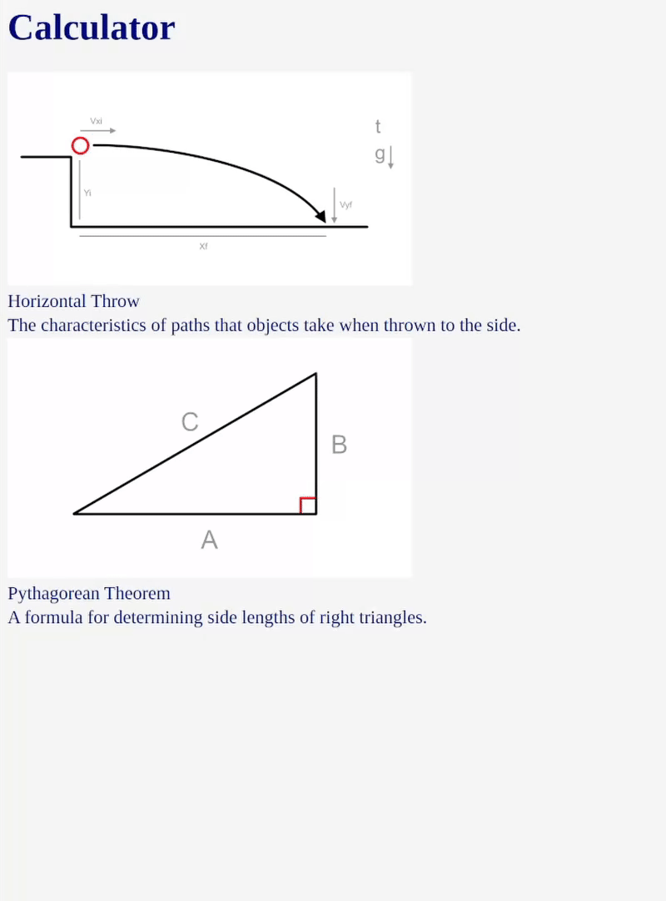
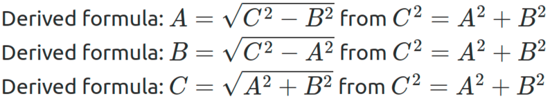

# Ultracalc
A proof of concept calculator that solves frequently occurring physics and math problems and outputs the steps taken. It is based on a custom symbolic evaluation engine, allowing the easy addition of new types of problems.

As most problems can be defined using just a single equation, the engine is capable of automatically rearranging and deriving different formulas from one input.

